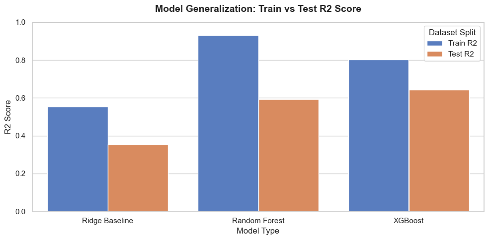

# Predicting Video Game Commercial Success on Steam
### An End-to-End Supervised Learning Pipeline with Temporal Validation and SHAP Interpretability

[](https://www.python.org/)
[]()
[](https://www.mit.edu/~amini/LICENSE.md)

---

## Research Question

> *What game characteristics, observable at the time of release, are most predictive of long term commercial success on Steam — and does this relationship vary by genre?*

Most existing analyses of Steam data treat success prediction as a straightforward regression task. This project addresses two methodological gaps commonly overlooked in similar work: (1) the use of random train/test splits that leak future information across a time-ordered dataset, and (2) the absence of post-hoc interpretability that would allow actionable conclusions beyond leaderboard metrics.

---

## Project Status

| Stage | Status | Notes |
|---|---|---|
| EDA — round 1 (raw data) | ✅ Completed | Catalogued structural issues: column shift, dtype mismatches, ~99.97% null `Achievements` |
| Cleaning — round 1 (structural) | ✅ Completed | Removed duplicates, non-game entries, and 883 utility-software rows (`02_cleaning_initial.ipynb`) |
| EDA — round 2 (patterns & target) | ✅ Completed | Defined `success_score`; identified `num_tags` and `game_age_days` as strongest predictors (`03_eda_final.ipynb`) |
| Cleaning — round 2 (final prep) | ✅ Completed | Extract modular `src/data_cleaning` pipeline, apply transformations, align & encode genres, and temporal split (`04_cleaning_final.ipynb`) |
| Feature engineering | ✅ Completed | Time, price, genre, tag, text sentiment features (`04_cleaning_final.ipynb`) |
| Baseline model (Linear Regression) | ✅ Completed | Ridge Baseline model (`Test R2: 0.36`) |
| Tree models (Random Forest, XGBoost) | ✅ Completed | Random Forest (`Test R2: 0.59`) and XGBoost (`Test R2: 0.64`) |
| SHAP analysis & error analysis | ✅ Completed | SHAP beeswarm plot, dependence plots, and high-error cluster analysis (`06_evaluation.ipynb`) |
| MLflow experiment tracking | ✅ Completed | SQLite experiment logging of metrics/params/models |
| Streamlit deployment | ✅ Completed | Interactive predictor with user inputs, sentiment scores, and SHAP waterfalls (`app/streamlit_app.py`) |

---

## Dataset

**Source:** [Steam Games Dataset — Kaggle](https://www.kaggle.com/datasets/fronkongames/steam-games-dataset)

~122,000 raw games including release date, genre, tags, price, review count, and review sentiment ratio.

> `games_clean.r1.csv` is not included in this repo due to file size.  
> To reproduce it, run `notebooks/02_cleaning_initial.ipynb`.

**Target variable:** A composite success score defined as:

```
success_score = log1p(review_count) × wilson_lower_bound(positive, negative)
```

This captures both reach (total reviews as a proxy for sales volume) and quality (review confidence), reflecting each game's cumulative performance up to the dataset snapshot date. The log transform addresses the strong right skew in review counts. The Wilson lower bound replaces a raw positive ratio, penalising games with few reviews where the observed ratio is statistically unreliable. The choice of this formulation over alternatives (raw review count, rating alone) is discussed in `notebooks/03_eda_final.ipynb`.

---

## Data Pipeline

This project uses an **iterative two-pass approach** to EDA and cleaning, rather than a single linear pass. This reflects how data issues are discovered in practice: you cannot know what to clean until you have looked at the data, and you cannot trust patterns in the data until it is clean enough to analyse.

### Round 1 — understand the raw data, fix structural problems

**EDA round 1** (`notebooks/01_eda_raw.ipynb`): Load the raw dataset and get a structural understanding: column types, missing value rates, value ranges, obvious anomalies. The goal is not to find patterns yet, but to catalogue problems.

**Cleaning round 1** (`notebooks/02_cleaning_initial.ipynb`): Fix structural issues identified in round 1: duplicates, broken encodings, non game entries (e.g. dlc, test apps), type conversions, and columns with too many nulls to be useful.

### Round 2 — find the patterns, prepare for modelling

**EDA round 2** (`notebooks/03_eda_final.ipynb`): With a structurally clean dataset, analyse distributions, correlations, and genre/tag breakdowns in depth. Define and justify the target variable here. Identify which transformations the data needs before modelling (log transforms, encoding strategies).

**Cleaning round 2 / final prep** (`notebooks/04_cleaning_final.ipynb`): Apply transformations informed by round 2 EDA. Create the target variable. Apply the temporal train/test split. Export the modelling-ready dataset to `data/processed/`.

---

## Methodology

### Temporal train/test split

Unlike random splits, this project uses a **time based split**: games released before 2020 form the training set; games from 2020–2023 form the held-out test set. This prevents data leakage from future games into the model and reflects real-world deployment conditions where a model trained on historical data must generalise to future releases.

### Feature engineering

Features are constructed exclusively from information available at launch:

- **Temporal:** release year, game age at evaluation date
- **Pricing:** log(price + 1), free-to-play binary flag, price tier (free / budget / mid / premium)
- **Genre structure:** number of genres, primary genre, one hot encoding of top genres
- **Tag structure:** number of tags, frequency encoded tag features
- **Text:** compound sentiment score from descriptions via VADER

### Models

Three supervised learning models are trained and compared:

| Model | Purpose |
|---|---|
| Ridge Regression | Interpretable baseline; establishes minimum viable performance via L2-regularised linear model |
| Random Forest | Captures non-linear relationships; provides native feature importances |
| XGBoost | Expected best performer; compatible with SHAP for post-hoc interpretability |

### Evaluation

Beyond standard metrics (RMSE, MAE, R²), the evaluation section includes:

- **Residual analysis by genre** — does the model systematically over/under predict certain genres?
- **Residual analysis by price band** — does performance degrade for free-to-play or high-price titles?
- **SHAP beeswarm plot** — global feature importance with directional effect
- **SHAP dependence plot** — non-linear relationship between price and predicted success
- **High-error case analysis** — manual inspection of the 20 most mis-predicted games

---

## Repository Structure

```
steam-ml-project/
│
├── assets/                         # Static image assets (generalization, distributions)
│
├── data/
│   ├── raw/                        # Original Kaggle dataset (not tracked in git)
│   └── processed/                  # Cleaned, modelling ready data
│
├── notebook/
│   ├── 01_eda_raw.ipynb            # Round 1 EDA — raw data structure and problems
│   ├── 02_cleaning_initial.ipynb   # Round 1 cleaning — structural fixes
│   ├── 03_eda_final.ipynb          # Round 2 EDA — patterns, target variable definition
│   ├── 04_cleaning_final.ipynb     # Round 2 cleaning & feature engineering — final prep, split, export
│   ├── 05_modelling.ipynb          # Model training and comparison
│   ├── 05_modelling_portfolio.ipynb # Portfolio-focused copy of model training and tuning
│   ├── 06_evaluation.ipynb         # SHAP, residual analysis, error cases
│   ├── 06_evaluation_portfolio.ipynb # Portfolio-focused copy of evaluation and diagnostics
│   └── mlruns/                     # MLflow tracking (auto-generated)
│
├── src/
│   ├── data_cleaning.py            # Reusable cleaning & feature engineering functions
│   ├── train.py                    # Model training and cross validation
│   └── evaluate.py                 # Metrics and visualisation utilities
│
├── models/                         # Serialised model artefacts
├── app/
│   └── streamlit_app.py
│
├── requirements.txt
└── README.md
```

---

## Key Findings (updated as project progresses)

*This section is updated iteratively as each stage completes.*

**Round 1 EDA observations:**
- **Dataset Integrity:** Validated 122,611 unique game records across 39 features, confirming strict data uniqueness with zero duplicate rows or `AppID` overlaps.
- **Schema Correction:** Resolved a persistent column shift misalignment caused by pandas incorrectly defaulting `AppID` as the row index (fixed via `index_col=False`), and identified a potentially merged `DiscountDLC count` header requiring further investigation.
- **Data Quality & Type Casting:** Flagged unusable features (`Achievements` at ~99.97% null) and identified critical dtype mismatches requiring conversion: `Release date` (object → datetime), `Metacritic score` (erroneously bool), `Metacritic url` (erroneously int64), and `Average playtime` (object → numeric).
- **Zero-Inflated Engagement:** Uncovered massive right skew across all player activity metrics; the median for Peak CCU, reviews, and playtime is 0, indicating that mean based metrics will be heavily dominated by a few massive outliers.
- **Market Distribution:** Analyzed the pricing spread ($0 to $999.98) and found a highly skewed $2.24 median, reflecting the platform's heavy dominance of free-to-play and budget titles.

**Round 2 EDA observations:**
- **Time-on-market confound confirmed but partial:** Median review count by release year collapses from 2017 onward as annual releases explode, reflecting dilution rather than declining quality. The effect is real but not deterministic — young titles like *Black Myth: Wukong* (2024) reached the same top tier as decade old games — so `game_age_days` is carried forward as a model feature rather than used to adjust the target variable.
- **Genre and tag differences appear genuine:** Average success score per genre and tag showed no consistent relationship with age or category size, suggesting these differences reflect real signal rather than platform-history artefacts.
- **Wilson lower bound chosen over Bayesian averaging:** Wilson requires no global prior, which suits this dataset's heavy skew. The top five games by `success_score` (Counter-Strike 2, Terraria, Garry's Mod, Black Myth: Wukong, Stardew Valley) are all genuine commercial successes, supporting the formula.
- **Strongest predictors:** `num_tags` (r ≈ 0.52) and `game_age_days` (r ≈ 0.41) correlate far more strongly with `success_score` than Price, Achievements, DLC count, or Peak CCU (all below 0.10).
- **Retroactive cleaning fix:** Genre analysis surfaced non-game software (e.g. *Wallpaper Engine*) that slipped through round 1 filtering. A conservative genre-based rule was added to `02_cleaning_initial.ipynb`, removing 883 rows.

**Modelling findings:**
- **Leaderboard:** XGBoost achieved the best test performance (`Test R2: 0.6417`, `Test RMSE: 1.189`, `Test MAE: 0.9567`), followed by Random Forest (`Test R2: 0.5930`) and Ridge Baseline (`Test R2: 0.3554`). The Ridge result confirms the feature-target relationship is genuinely non-linear; the jump to tree models accounts for that structure.
- **Overfitting:** Random Forest showed the largest train/test gap (train `R2: 0.9326` vs test `R2: 0.5930`), indicating significant overfitting at `max_depth=20`. XGBoost's sequential correction mechanism produced a more controlled gap (train `R2: 0.8038` vs test `R2: 0.6417`) with best hyperparameters `learning_rate=0.03`, `max_depth=7`, `n_estimators=200`, `subsample=0.8`.
- **Interpretation:** A test R² of 0.64 indicates that launch-day characteristics explain a meaningful but not dominant share of variance in long-term commercial success. The remaining unexplained variance is likely attributable to unobserved signals — marketing spend, influencer coverage, community momentum — that are absent from the on-platform feature set.
- **Tracking & Serialization:** All runs were logged to an MLflow SQLite backend. The best model was serialized to `models/best_model.joblib` alongside the training feature column order at `models/feature_names.joblib` for downstream inference.



---

## Limitations and Future Work

**Limitations**

- **Time-on-market bias:** Lifetime review counts favour older games, though EDA confirmed this effect is partial rather than deterministic, young titles can and do reach the same top tier as older ones. `game_age_days` is carried forward as a model feature to let this effect be quantified directly rather than corrected for in the target variable itself, meaning a 2010 game and a 2022 game remain not directly comparable on `success_score` alone.
- **Unobserved marketing:** The dataset is restricted to on-platform Steam metrics. Pre-release hype, influencer coverage, ad spend, and community building on platforms like Discord or Reddit are not captured, yet likely drive a meaningful share of a game's commercial outcome.
- **Sales proxy:** Review count serves as a proxy for sales volume since Steam does not publish sales figures. The ratio of purchases to reviews varies across genres, price points, and player demographics, so the proxy is imperfect and inconsistent.
- **Platform scope:** The model is trained exclusively on Steam (PC). Findings may not generalise to console or mobile markets, which have different discovery mechanisms, pricing norms, and player behaviour.

**Future work**

- **Genre stratification:** Train genre-stratified models to test whether success drivers differ meaningfully across categories (e.g., action vs. simulation vs. indie).
- **Off-platform viral signals:** Incorporate external metrics like Twitch peak viewer counts or YouTube trailer views to capture influencer-driven viral spikes identified in our high-error analysis (e.g., *HoloCure*, *FPS Chess*).
- **Advanced description NLP:** Replace rule-based VADER sentiment with transformer-based embeddings (e.g., DistilBERT) to analyze the semantic complexity and emotional layout of store listings.
- **Dynamic pricing engine:** Develop a utility-maximization pricing engine inside the app to recommend price points that maximize projected revenue based on target genres and tags.

---

## Interactive Predictor App

To turn our modelling and interpretability findings into a practical tool for developers, we deployed an interactive web application using **Streamlit** (`app/streamlit_app.py`).

### Key Features
- **Dynamic Parameter Inputs:** Developers can input key launch parameters including price, planned achievements, DLC counts, platform targets (Windows, Mac, Linux), primary genre, and descriptive tags.
- **VADER Sentiment Analysis:** The application uses NLTK VADER to run real-time sentiment analysis on the store description, feeding the compound score into the model.
- **Live success_score Prediction:** Estimates the game's commercial success score instantly using our optimal serialized XGBoost model.
- **Local SHAP Waterfall Explanations:** Generates and displays a local SHAP waterfall plot, showing exactly which features contributed positively or negatively to that specific game's prediction.
- **Optimization Recommendations:** Provides tailored recommendations on how to improve the game's predicted success (e.g., pricing recommendations, platform targeting flags, description sentiment tips, or tag density advice).

### Running the App
To start the local Streamlit server from the project root, run:
```bash
# In your active environment:
streamlit run app/streamlit_app.py

# If streamlit is not on your global zsh path:
/opt/anaconda3/bin/streamlit run app/streamlit_app.py
```

---

## Setup

> All core project dependencies are locked and documented in `requirements.txt`.


```bash
git clone https://github.com/haoran-png/Predicting-Video-Game-Commercial-Success-on-Steam.git
cd Predicting-Video-Game-Commercial-Success-on-Steam
pip install -r requirements.txt
```

Download the dataset from [Kaggle](https://www.kaggle.com/datasets/fronkongames/steam-games-dataset) and place it in `data/raw/`.

---

## Author

**[Haoran Jinfu]**
BSc Mathematics with Data Science | [LinkedIn](https://www.linkedin.com/in/haoranjinfu/)

---

*Note: AI tools were used to assist in writing and refining this code.*
